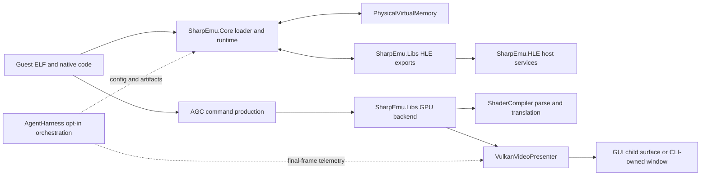
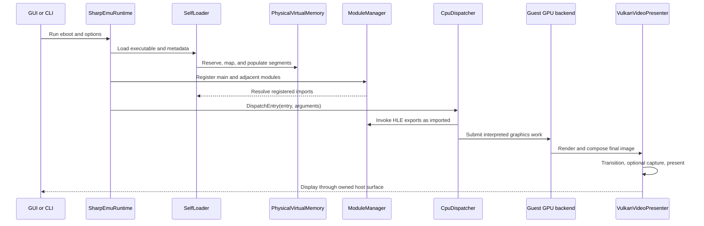

<!-- Copyright (C) 2026 SharpEmu Emulator Project -->
<!-- SPDX-License-Identifier: GPL-2.0-or-later -->

# SharpEmu architecture

## 1. Purpose and non-goals

SharpEmu is a research-oriented PlayStation 5 emulator. The executable loads a game ELF, maps guest memory, resolves imports to high-level emulation (HLE) libraries, enters native guest code, interprets platform graphics work, translates shaders, and presents through a host backend. Host implementations must reproduce guest-visible contracts; this architecture does not make host APIs interchangeable with console APIs, and the agent harness is not an alternate emulator implementation.

## 2. Host and guest boundary

Guest addresses and host addresses meet in `src/SharpEmu.Core/Memory/PhysicalVirtualMemory.cs`. Loader mappings, CPU dispatch, HLE functions, and GPU resources use this boundary; a guest pointer is never ordinary trusted host memory. `src/SharpEmu.HLE/` supplies host-side facilities used by HLE libraries, while `src/SharpEmu.Libs/` exposes console-facing library behavior. Native handles, pointers, lengths, and lifetimes must be validated at the owning boundary.

## 3. Launch and boot flow

`src/SharpEmu.CLI/Program.cs` is the process entry point. With no command-line game it enters the GUI path; with an eboot it parses diagnostics options, constructs the runtime, and starts emulation. `src/SharpEmu.GUI/EmulatorProcess.cs` launches the CLI as a child for GUI play, and `src/SharpEmu.GUI/GameSurfaceHost.cs` owns the host surface relationship.

`src/SharpEmu.Core/Runtime/SharpEmuRuntime.cs` coordinates boot. `src/SharpEmu.Core/Loader/SelfLoader.cs` reads and maps the eboot ELF, applies supported relocation/import information, and reads adjacent metadata. The runtime creates the memory and CPU-dispatch facilities, registers the main module, loads adjacent modules, runs module initializers, and calls `CpuDispatcher.DispatchEntry` to enter native guest execution.

Imports are registered and resolved by `src/SharpEmu.HLE/ModuleManager.cs` and its source-generated export registry. Kernel-like library contracts live in the appropriate `src/SharpEmu.Libs/` subsystem, supported by the host primitives in `src/SharpEmu.HLE/`; they do not belong in the CLI or harness.

## 4. Graphics and presentation flow

AGC-facing exports and command handling are under `src/SharpEmu.Libs/Agc/` and `src/SharpEmu.Libs/Gpu/`. `VulkanGuestGpuBackend` owns the Vulkan guest-GPU execution path and delegates presentation to `src/SharpEmu.Libs/VideoOut/VulkanVideoPresenter.cs`. VideoOut exports and display-buffer lifecycle live under `src/SharpEmu.Libs/VideoOut/`.

Shader parsing and platform-independent translation live in `src/SharpEmu.ShaderCompiler/`. `src/SharpEmu.ShaderCompiler.Vulkan/` emits the Vulkan/SPIR-V host representation; `src/SharpEmu.ShaderCompiler.Metal/` owns the Metal path. Shader semantics and host Vulkan submission are distinct responsibilities.

The presenter records swapchain transitions and final rendering, applies overlay work, and submits presentation. Opt-in harness capture attaches immediately before presentation, copying the final swapchain image through an existing host-visible staging buffer with explicit image barriers. When disabled, it adds no capture copy, wait, mapping, or file output.

## 5. Project and module map

| Project | Ownership |
|---|---|
| `src/SharpEmu.CLI` | Process entry, command-line mode, GUI selection, top-level diagnostics and mitigation setup |
| `src/SharpEmu.GUI` | Desktop UI, child emulator process, and game surface hosting |
| `src/SharpEmu.Core` | Runtime lifecycle, ELF/self loading, guest memory, CPU dispatch, module representation |
| `src/SharpEmu.Libs` | Guest-facing HLE libraries, import registry, AGC/GPU/VideoOut, audio, input, and platform services |
| `src/SharpEmu.HLE` | Reusable host-side service implementations and OS abstractions used by HLE libraries |
| `src/SharpEmu.ShaderCompiler` | Shader decoding, intermediate semantics, validation, and common translation |
| `src/SharpEmu.ShaderCompiler.Vulkan` | Vulkan/SPIR-V shader emission |
| `src/SharpEmu.ShaderCompiler.Metal` | Metal shader emission |
| `src/SharpEmu.Logging` | Logging, build provenance, summaries, and opt-in structured harness telemetry |
| `src/SharpEmu.Debugger` / `SharpEmu.DebugClient` | Debug protocol server-side integration and client model |
| `src/SharpEmu.SourceGenerators` | Compile-time export and catalog generation/analyzers |
| `tools/SharpEmu.Tools.AgentHarness` | Local orchestration, index, bounded runs, visual analysis, and private-input validation |
| `tools/SharpEmu.Tools.ShaderDump` / `GpuConformance` | Focused shader and GPU investigation utilities |

## 6. Dependency and ownership boundaries

The CLI and GUI compose the emulator; guest semantics remain in Core, Libs, HLE, and shader projects. Core owns loading, memory, and execution lifecycle. Libs owns named guest APIs and routes host work through HLE abstractions. Source generators create registry glue but do not define runtime policy. Shader backends depend on the common shader model, while VideoOut/GPU owns host device and presentation coordination.

Move behavior to the project that owns the guest-visible contract. Avoid dependencies from production projects onto test or tool projects. The agent harness may launch and observe production code, but production code depends only on the small telemetry facility in `SharpEmu.Logging`, never on the harness executable.

## 7. Runtime state and lifecycle

The runtime lifetime begins with memory, loader, dispatcher, module registry, and configured HLE services. Module registration precedes import resolution and initializer execution; guest entry follows those steps. Teardown must stop guest activity before releasing libraries, GPU work, presenter resources, and memory. Repeated open/close and shutdown paths are state transitions, not interchangeable success returns.

Graphics state spans guest queues and labels, decoded commands, translated shaders, host buffers/images, synchronization objects, swapchain images, and presentation slots. Resource lifetime and synchronization must follow the actual producer/consumer chain.

## 8. Observability and debugger path

`src/SharpEmu.Logging` provides normal logs and runtime summaries. The CLI accepts log-file, log-level, and bounded import-trace options. `src/SharpEmu.Debugger` and `src/SharpEmu.DebugClient` implement the loopback debugger protocol; the CLI hosts the server when requested. Existing logging and debug paths remain primary diagnostics.

The harness adds JSONL lifecycle events only when `--harness-config` is explicitly supplied. Events identify milestones such as metadata load, module load, guest entry, VideoOut open, graphics submission, shader translation, first presentation, exit, and host exception. The first-host-frame milestone proves only the host presentation/capture path; it does not prove a valid guest submission or render. Guest-graphics progress requires separate direct evidence, and a presented splash or key art is not successful game rendering. Events supplement logs; they do not replace the debugger or alter guest results.

## 9. Tests and tools

`tests/SharpEmu.Libs.Tests` covers Core-adjacent, HLE, library, CPU, GPU, and VideoOut behavior. Shader tests are split across `SharpEmu.ShaderCompiler.Tests` and `SharpEmu.ShaderCompiler.Metal.Tests`; generator tests live in `SharpEmu.SourceGenerators.Tests`. `tests/SharpEmu.Tools.AgentHarness.Tests` covers Roslyn indexing, tracked-file/incremental behavior, process-tree cleanup, raw pixel normalization, PNGs, metrics, comparison, and archive-path safety.

Use `scripts/agent-harness.ps1` as the stable local entry point. Generated indexes and runs are under `.local/index/<commit>/` and `.local/runs/<run-id>/` and are not source assets.

## 10. Agent-harness boundary

The harness validates local profiles, launches the existing CLI in a Windows Job Object, applies a hard timeout, captures its existing stdout/stderr/logging, writes structured artifacts, and analyzes opt-in frames. Its game-input command validates and stages legally supplied local archives outside Git. It must neither understand game code nor implement guest APIs.

Production attachments are narrow: CLI configuration, lifecycle event calls in the existing runtime/library paths, and a guarded final-swapchain copy. Ordinary launches without `--harness-config` do not create events or frame artifacts.

## 11. Architectural invariants

- Guest pointers are untrusted guest addresses, not ordinary host pointers.
- Host services model guest-visible behavior, including errors, ordering, and side effects.
- Loader, HLE, shader translation, GPU execution, and presentation have separate ownership.
- Shader translation and host Vulkan execution are separate concerns.
- Vulkan synchronization follows actual resource transitions and lifetime.
- Instrumentation is explicit, bounded, behavior-neutral, and inert when disabled.
- Private game data, run artifacts, captures, and research ledgers remain outside the repository.
- The harness orchestrates the emulator and must never become an alternate implementation of emulator semantics.

## 12. Where to change what

| Issue | Start here | Verify with |
|---|---|---|
| ELF segment, relocation, metadata, adjacent module | `SharpEmu.Core/Loader/SelfLoader.cs`, `Runtime/SharpEmuRuntime.cs` | Loader/runtime events and narrow Libs tests |
| Guest memory or address translation | `SharpEmu.Core/Memory/PhysicalVirtualMemory.cs` | Range/overflow/lifetime tests |
| Import or guest library behavior | `SharpEmu.HLE/ModuleManager.cs`, owning Libs folder, supporting HLE host service | Export registry and owning library tests |
| CPU entry or native dispatch | `SharpEmu.Core/Cpu/`, runtime dispatch call | CPU tests, exception/event evidence |
| AGC command or guest GPU state | `SharpEmu.Libs/Agc/`, `SharpEmu.Libs/Gpu/` | GPU tests, validation logs, bounded capture |
| Shader decode or semantics | `SharpEmu.ShaderCompiler` | common compiler tests and shader dump |
| SPIR-V/Vulkan shader emission | `SharpEmu.ShaderCompiler.Vulkan` | compiler tests and external validator when installed |
| Display buffers, swapchain, presentation | `SharpEmu.Libs/VideoOut/` | VideoOut tests, Vulkan validation, native capture |
| GUI process or embedded surface | `SharpEmu.GUI/EmulatorProcess.cs`, `SharpEmu.GUI/GameSurfaceHost.cs` | GUI/CLI build and owned-window exercise |
| Logs or debugger | `SharpEmu.Logging`, `SharpEmu.Debugger`, `SharpEmu.DebugClient` | log/event schema and loopback protocol tests |
| Source navigation or run orchestration | `SharpEmu.Tools.AgentHarness`, `scripts/agent-harness.ps1` | harness tests and synthetic run |
| Performance | owning subsystem after measurement | repeated equivalent run metrics and correctness tests |

## 13. Intentional uncertainty

Some guest APIs and AGC packets are intentionally incomplete, and support varies by exercised command or shader feature. A registered export does not by itself prove contract completeness; a text match does not prove a runtime call edge; successful presentation does not prove correct rendering. Where source, public specification, and reproducible observation do not establish behavior, record the uncertainty and add evidence rather than filling it with assumed console semantics.
